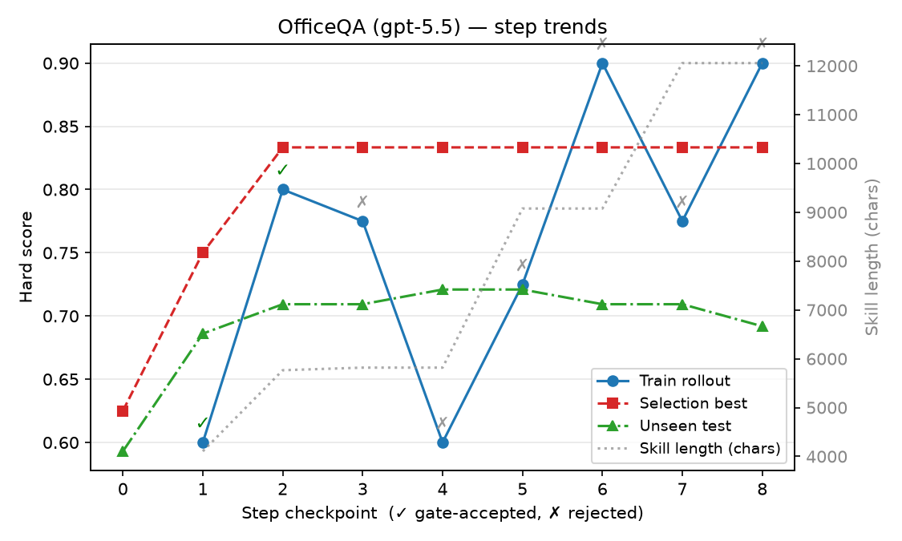

# SkillOpt 复现与 Skill 归因 —— 现阶段工作概览

> 一句话:我们在**本地 GitHub Copilot 代理 + gpt-5.5** 上复现了 SkillOpt,
> 并搭了一套**「哪一次改动 / 哪一句话起了作用」的归因评测框架**,得到了
> 一致且清晰的结论 —— **skill 的价值非常稀疏**。
>
> 详细日志见 [`REPRODUCTION_PROGRESS.md`](./REPRODUCTION_PROGRESS.md);
> 研究思路见 [`IDEAS.md`](./IDEAS.md);项目记忆见 [`AGENTS.md`](./AGENTS.md)。

---

## 1. 我们在做什么

分两条线:

1. **复现**:用同一份上游 split、同样的 gpt-5.5,在本地代理上跑 SkillOpt 的
   benchmark(OfficeQA / DocVQA / SearchQA / SpreadsheetBench / LiveMath / ALFWorld)。
2. **归因(本阶段重点)**:不满足于"加了 skill 涨了多少分",而是回答
   **价值具体来自哪里** —— 哪一次优化迭代、skill 里的哪一句话,真正贡献了分数。

---

## 2. 核心发现:skill 的价值是稀疏的

### 发现 A —— 仓库的 "no-skill" 基线被模板抬高了(复现阶段)

仓库的 *no-skill* 数字不是真正的 vanilla 基线:它被**常驻 system-prompt 模板**抬高了,
模板里硬编码了一段几乎等同于"待学习 skill"的规则。同模型、同 split 的受控 A/B:

| Benchmark | 指标 | 模板基线 | 剥掉规则(bare) | 模板隐藏加成 |
|---|---|--:|--:|--:|
| OfficeQA | EM | 0.547 | 0.285 | **+26 pts** |
| DocVQA | ANLS | 0.918 | 0.860 | **+5.8 pts** |

而**方法本身是能复现的**:在 bare 基线上,加 skill 的增益与论文一致
(SpreadsheetBench +38.2 vs 论文 +38.9,DocVQA +10.5 vs +12.4,SearchQA +6.7 vs +9.6)。

### 发现 B —— 句子级归因:85% 的价值来自一句"格式句"

工具 [`scripts/eval_skill_ablation.py`](./scripts/eval_skill_ablation.py) 对模板的
`## Rules`(6 条)做受控消融,在固定的 172 条 OfficeQA 测试集上测(gpt-5.5):

- **full(6 条)= 0.529　bare(0 条)= 0.337　→ 整段规则值 +19.2 EM**

| # | 规则(节选) | LOO Δ¹ | add-one Δ² |
|---|---|--:|--:|
| 1 | Use only the provided local document tools | +0.000 | +0.099 |
| 2 | Narrow to the most relevant file first | +0.012 | +0.012 |
| 3 | Prefer short targeted searches, small reads | +0.017 | +0.029 |
| 4 | Do not invent ungrounded values | −0.006 | **−0.058** |
| 5 | Extract exact operands before arithmetic | +0.047 | +0.052 |
| 6 | Return final answer inside `<answer>...</answer>` | **+0.163** | **+0.163** |

¹ 去掉这条掉多少分(不可或缺度)　² 在 bare 上只加这条涨多少分(独立价值)

- **~85% 的价值集中在 Rule 6(输出格式句)**:评测器从 `<answer>` 标签抽答案,
  少了这句模型常不打标签 → 判错。所谓 "skill" 主要是 **harness 格式合规**,不是领域推理。
- **Rule 4("不要臆造")是负贡献**(单独加 −0.058)—— 该被优化器删掉的句子。

### 发现 C —— 过程级归因:93% 的提升来自前 2 次迭代,之后是"膨胀"

跑一次完整 OfficeQA 训练(4 epoch / 8 步;gate 只接受了第 1、2 步,拒了 6 步;
skill 从 902 → 14,308 字符),用 `--versions-dir` 逐版本在测试集上测:

| 版本 | 测试 EM | Δ | 说明 |
|---|--:|--:|---|
| v0(初始) | 0.593 | — | |
| v1 | 0.686 | **+0.093** | 第 1 步(gate 接受) |
| v2 | 0.709 | **+0.023** | 第 2 步(gate 接受,最佳) |
| v3 | 0.709 | 0.000 | 第 3 步被拒(= v2) |
| v4 | 0.721 | +0.012 | epoch-2 slow-update |
| v6 | 0.709 | −0.012 | epoch-3(回退) |
| v8 | 0.692 | −0.017 | epoch-4(回退) |
| best_skill(第 2 步) | **0.733** | — | gate 选中的最佳点 |

- **~93% 的真实提升来自前 2 次被 gate 接受的改动**(v0→v2,+0.116)。
- **epoch 1 之后的无条件 slow-update 是膨胀**:skill 翻了一倍多,但测试 EM
  反而下滑(0.709→0.692)。**文本更长 ≠ skill 更强**。
- **gate 是有效的**:它选中的第 2 步 best_skill(0.733)才是真正的最高点。

下图把这次 OfficeQA 训练画成论文 `epoch-trends` 同款(✓ = gate 接受,✗ = 拒绝;
灰点 = skill 长度):**Selection best 在前 2 步跳升后全平,Unseen test 涨到中段即回落,
而 skill 长度一路从 4k 爬到 12k —— 分数停涨之后纯属膨胀。**



复跑:`python scripts/plot_training_curve.py --run <out_root> --version-curve <version_curve.csv>`。

> 两条归因线索一致:**价值集中在少数几次早期改动、以及其中的一句格式句;
> skill 文档的大部分长度要么无贡献,要么轻微有害。**

---

## 3. 我们交付了什么

- **新工具** `scripts/eval_skill_ablation.py` —— 复用 `eval_only.py` 的评测原语,提供:
  - 句子级:`--section` 对模板某段做 full / bare / LOO / add-one 消融(改→测→还原,保证还原)。
  - 过程级:`--versions-dir` 逐 `skill_v*.md` 评测,出"分数 vs 版本"曲线(对相同内容的被拒步做 sha256 去重)。
- **代码修复(复现所需)**:gpt-5.5 Responses-API 路由、tool_call 修复、**视觉输入修复**
  (list content 的 text+image 被字符串化导致丢图)、OfficeQA 环境开关、数据物化脚本、Windows utf-8 读取。
- **文档**:本概览、`REPRODUCTION_PROGRESS.md`、`officeqa_reproduction_report.md`、`docvqa_reproduction_report.md`。

代码同时同步在个人仓库 `litaohz/SkillOpt`(分支 `research/a3-skill-retrieval`)
与 `gim-home/skillopt`(已合入 main)。

---

## 4. 下一步

- 把同样的「句子级 + 过程级」双视角分析复制到 **DocVQA / SpreadsheetBench**,
  验证"价值集中在格式句 / 前几步"是否普遍成立。
- 把 ablation 升级为 **MCTS / Shapley** 的组合归因(见 `IDEAS.md`),捕捉规则间的交互效应,
  得到最小有效子集与负作用片段排序。
- 将"Rule 4 有害、epoch-1 之后是膨胀"等信号作为具体建议反馈给 SkillOpt 作者:
  把过程性规则移出常驻模板、给 slow-update 加 gate、匿名化 OfficeQA 文件名(日期泄漏)。

---

## 5. 怎么复跑

```powershell
$env:OPENAI_RESPONSES_API_MODELS="gpt-5.5"; $env:PYTHONIOENCODING="utf-8"; $env:NO_PROXY="localhost,127.0.0.1"

# 句子级消融(OfficeQA 模板 Rules)
python scripts/eval_skill_ablation.py `
  --template skillopt/envs/officeqa/prompts/rollout_system.md --section "## Rules" `
  --modes full bare loo addone `
  --config configs/officeqa/default.yaml --skill outputs/empty_skill.md `
  --split valid_unseen --split_dir data/officeqa_split `
  --out-root outputs/ablation_officeqa_gpt55 --eval-arg env.workers=12 `
  --azure_openai_endpoint http://localhost:4141/v1 --azure_openai_api_key dummy `
  --azure_openai_auth_mode openai_compatible --target_model gpt-5.5

# 过程级曲线(需先有一次训练产生的 skills/ 目录)
python scripts/eval_skill_ablation.py `
  --versions-dir outputs/train_officeqa_gpt55_v1/skills `
  --config configs/officeqa/default.yaml `
  --split valid_unseen --split_dir data/officeqa_split `
  --out-root outputs/version_curve_officeqa_gpt55 --eval-arg env.workers=12 `
  --azure_openai_endpoint http://localhost:4141/v1 --azure_openai_api_key dummy `
  --azure_openai_auth_mode openai_compatible --target_model gpt-5.5
```
